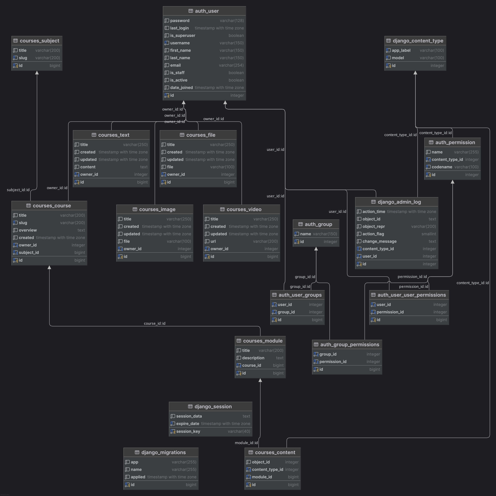

# Django Educa 🎓


**Django Educa** is an educational platform built with Django. It allows you to create courses, modules, and content for learning. The project includes models for managing courses, modules, text, video, and file content.

---

## Table of Contents 📚

- [Features](#features-)
- [Installation and Setup](#installation-and-setup-)
  - [Requirements](#requirements)
  - [Docker Setup](#docker-setup)
  - [Environment Configuration](#environment-configuration-)
  - [Database](#database-)
  - [Static Files](#static-files-)
- [ER Diagram](#er-diagram-)
- [License](#license-)
- [Contributing](#contributing-)

---

## Features ✨

- **Content Management System (CMS):** A powerful CMS for managing courses, modules, and content.
- **Admin Panel:** Built-in Django admin panel for easy content management.
- **Course Creation:** Create and manage courses with titles, descriptions, and overviews.
- **Module Management:** Organize courses into modules for structured learning.
- **Polymorphic Content:** Supports various content types, including text, video, and files.
- **User Authentication:** Secure user authentication and authorization system.
- **Docker Integration:** Easy setup and deployment using Docker.
- **Automated Workflow:** Uses Poetry for dependency management and automation.
- **Code Quality:** Integrated with Black, Flake8, and MyPy for clean and maintainable code.

---

## Installation and Setup 🚀

### Requirements

- Python 3.12+
- Docker
- Poetry (for dependency management)

### Docker Setup

1. **Clone the repository:**
   ```bash
   git clone https://github.com/macalistervadim/django-educa
   cd django-educa

### Environment Configuration ⚙️
The project uses a `.env` file to store sensitive data. Copy `.env.example` to `.env` and configure the variables:

```plaintext
# Example .env file

# Django
DJANGO_SECRET_KEY=your_secret_key_here
DJANGO_DEBUG=True
DJANGO_ALLOWED_HOSTS=127.0.0.1,localhost

# Database
POSTGRES_DB=educa
POSTGRES_USER=educa_user
POSTGRES_PASSWORD=educa_password
```

### Database 🗄️

The project uses PostgreSQL. To set up the database:

1. Load test data (optional):
   ```bash
   python manage.py loaddata fixtures/subjects.json

### Static Files 📂

To correctly display static files in production mode, run:
   
   ```bash
   python manage.py collectstatic
   ```

---

## ER Diagram 📊

Below is the ER diagram of the project's database:



---

## License 📜

This project is licensed under the MIT License. See the [LICENSE](LICENCE.md) file for details.

---

## Screenshots 📸

**Home Page**

[Home Page]

**Course Page**

[Course Page]

---

## Contributing 🤝

If you'd like to contribute to the project, please read the Contributing Guidelines.

---

## Acknowledgments 🙏

Thanks to everyone who supports this project!
