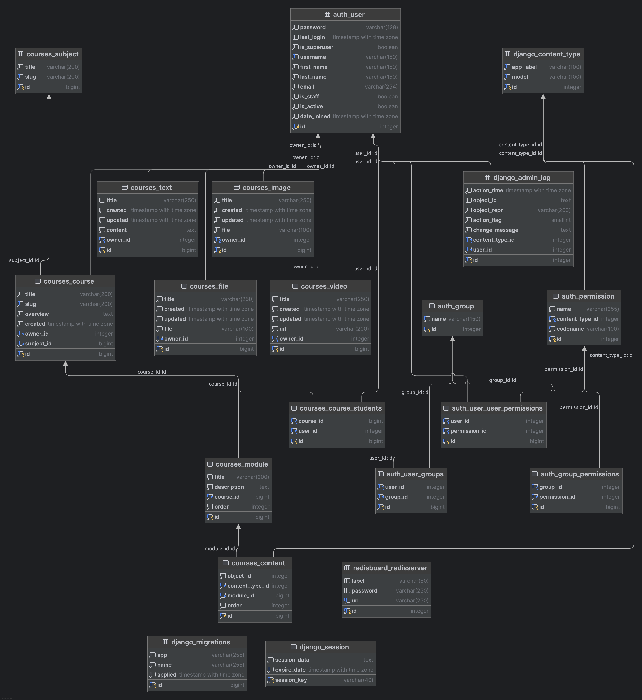
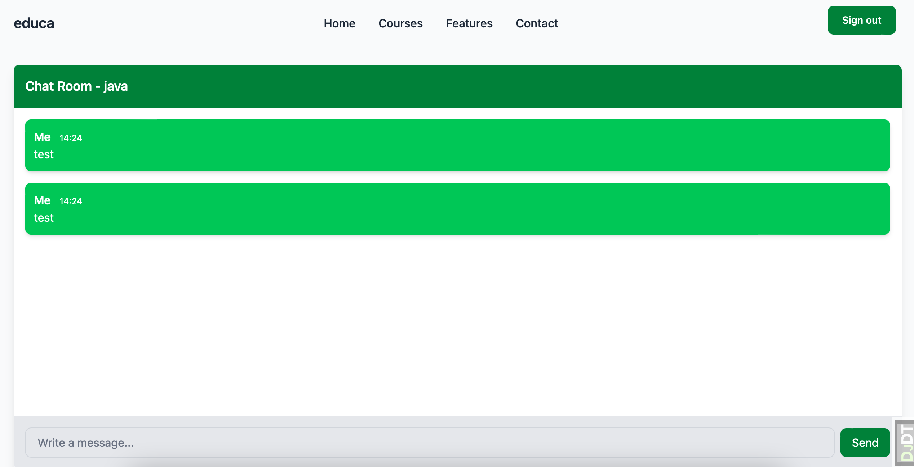
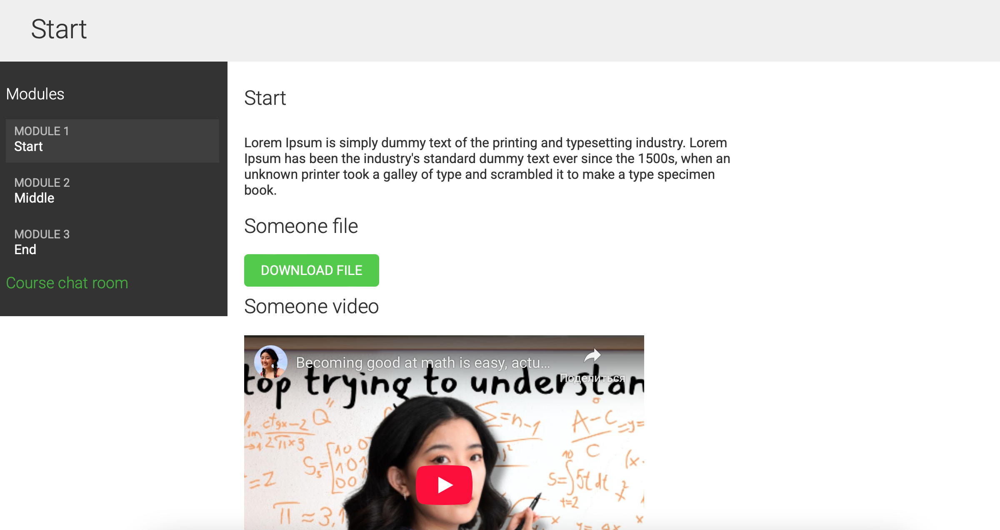
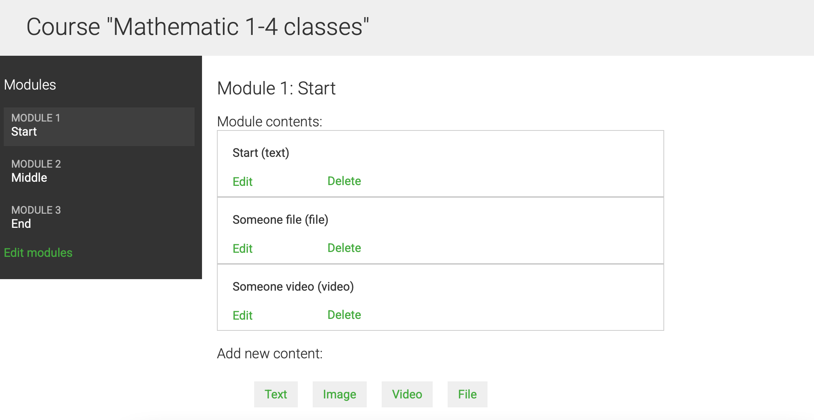
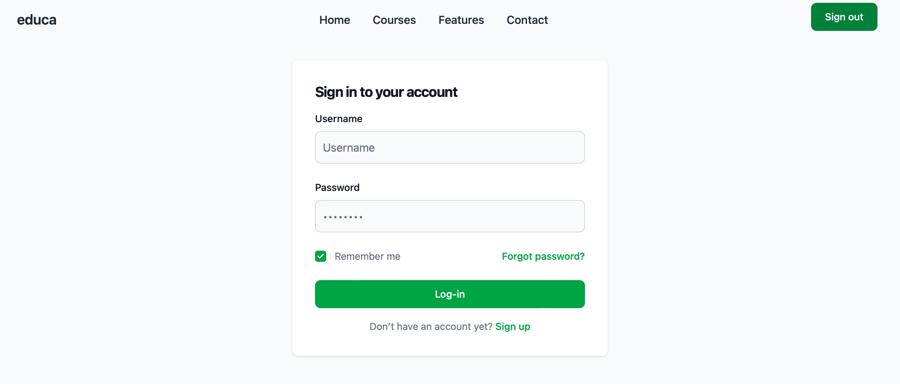

# Добро пожаловать в документацию проекта Django Educa 🎓

**Django Educa** - это образовательная платформа, созданная на Django. Она позволяет создавать курсы, модули и контент для обучения. Проект включает модели для управления курсами, модулями, текстовым, видео и файловым контентом.

---

## Возможности ✨

- **Система управления контентом (CMS):** Мощная CMS для управления курсами, модулями и контентом.
- **Админ-панель:** Встроенная админ-панель Django для удобного управления контентом.
- **Создание курсов:** Создание и управление курсами с заголовками, описаниями и обзорами.
- **Управление модулями:** Организация курсов в модули для структурированного обучения.
- **Полиморфный контент:** Поддержка различных типов контента, включая текст, видео и файлы.
- **Аутентификация пользователей:** Безопасная система аутентификации и авторизации пользователей.
- **Интеграция с Docker:** Простая настройка и развертывание с использованием Docker.
- **Автоматизация рабочего процесса:** Использование Poetry для управления зависимостями и автоматизации.
- **Качество кода:** Интеграция с Black, Flake8 и MyPy для чистого и поддерживаемого кода.

---

## Технологии ⚙️

Проект разработан с использованием современных технологий:

- **Django 5** — веб-фреймворк для Python, обеспечивающий быстрый старт и гибкость.
- **Python 3.12** — основной язык программирования.
- **PostgreSQL** — система управления базами данных для хранения информации.
- **Docker** — для контейнеризации приложения и упрощения процесса развертывания.
- **Poetry** — инструмент для управления зависимостями и упаковки Python проектов.
- **Gunicorn** — высокопроизводительный WSGI сервер для запуска Django приложения в продакшене.
- **Nginx** — веб-сервер для обработки запросов, проксирования их на Gunicorn и обеспечения безопасности с SSL.

---

## Установка и настройка

Для установки приложения и его запуска на вашем сервере, следуйте [инструкциям](installation.md).

---

## ER Диаграмма 📊

Ниже представлена ER диаграмма базы данных проекта:

---

## Лицензия 📜

Этот проект распространяется под лицензией MIT. Подробнее см. в файле [LICENSE](../../LICENCE.md).

---

## Скриншоты 📸

**Главная страница**

**Чат**

**Просмотр курса**

**Управление курсом**

**Вход в систему**

---

## Благодарности 🙏

Спасибо всем, кто поддерживает этот проект!